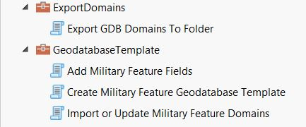
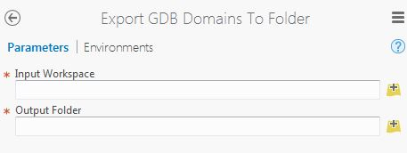
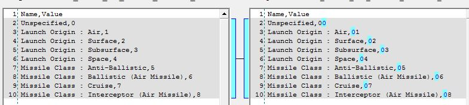

# military-features-data / data / mil2525d / utilities / military-features-utilities
==========================

## Purpose

* These utilities are used to create military feature classes, domains, and other feature and test data 
* Individual utilities and steps:
	* In template-gdb-toolbox: 
	    * Create Military Feature Geodatabase Template - creates a new geodatabase from source CSV(.csv) files.  Executes the following two tools while doing so.
	    * Import or Update Military Feature Domains - processes domain CSV(.csv) files found in a folder and imports and/or updates same in a target geodatabase.
	    * Add Military Feature Fields - adds the fields specified in a given schema to a given feature class.  The field specifications for the specified schema are defined in a CSV(.csv) file.  This also updates subtypes when encountered.
	* In export-domain-toolbox:
	    * Export GDB Domains to Folder - exports the geodatabase domains to CSV(.csv) files.

## Sections

* [Requirements](#requirements)
* [Instructions](#instructions)

## Requirements

* ArcGIS Professional 1.0+ (Toolbox requires ArcGIS Pro to open/use)

## Instructions

### Overview (All Tools)

These tools create feature classes, fields, and domains according to the specifications found in CSV files found in this repository:

1. Feature classes and fields are created from the CSV files found the a schema folder (`military_feature_schemas`) found [here](../../core_data/gdbs) in this repository.
2. Domains are created from a set of `Coded_Domain` CSV (.csv) files found in the domain folder (`name_domains_values`) found [here](../../core_data/gdbs) in this repository.

### Create Military Feature Geodatabase Template

#### Overview

The utility creates a new File Geodatabase (GDB) in a specified folder, replacing any existing geodatabase of the same name in that folder.  The version of the newly created geodatabase can also be specified.

A Versions table is added to the newly created geodatabase.  The contents of that Versions table is based on the [versions.csv](../style-utilities/merge-stylx-utilities/versions.csv) file found in this repo.  The "Version" information for `automated_creation_date` and `last_modification_date` are populated with the current date when the tool is run.

#### Steps

* Obtain the latest set of Military Features source data and utilities
	* Clone/download this repository to your local machine.
* Run ArcGIS Pro
* Navigate to the local location of the [template-gdb-toolbox GeoProcessing Toolbox](./template-gdb-toolbox).
* Run the *Create Military Features Geodatasbase Template* tool, found in the `GeodatabaseTemplate` toolbox.
	* For the `Schemas Folder` parameter, specify the folder containing the schema CSV files.  
	* For the `Geodatabase Destination Folder` parameter, specify a destination folder for the newly created file geodatabase.  The name used to create the geodatabase, together with its entire dataset structure, is specified in the `Schemas.csv` file found in the schemas folder.  Any existing geodatabase in the output folder, with the same name, will be overwritten.
	* For the `Version` parameter, select from the list of possible geodatabase versions.  The default of `CURRENT` means ArcGIS Desktop 10.1+, including ArcGIS Pro.
	* IMPORTANT: The *Create File Geodatabase* operation requires an exclusive schema lock on the geodatabase - therefore:
        * You should **not** have this geodatabase open elsewhere (for example, added to the current map), since you will be replacing it in that case, while performing this operation.
        * You must have full editing privileges (Update, Delete, etc.) to the folder and geodatabase you are creating/replacing in that folder.
    * When the tool runs successfully, open the geodatabase in design mode and verify that the expected feature dataset, feature classes, and domains have been created and that the feature classes have the fields expected.
    * Compare what is created with an existing military features [geodatabase](../../core_data/gdbs).
* IMPORTANT: Complete a few additional manual steps (these have not yet been fully automated)
    * Export the metadata from an existing Military Features GDB and import it into this one (using Import/Export Metadata GP tools)
	* Enable Editor Tracking for desired layers/fields (ex. "Created By" "Creation Time") using the Enable Editor Tracking GP Tool
	* A Toolbox, `Military Overlay Supplemental Tools_10.3.tbx`, has been included in this folder to assist with these steps. 
        * NOTE/IMPORTANT: this toolbox and these tools only run on ArcGIS Desktop 10 (import/export metadata tools)
	
### Add Military Feature Fields

#### Overview

The utility reads the field specifications, and in some cases subtype specifications, stored in CSV files (identified by schema name) and adds those fields to the specified feature class.  Note, the specified feature class must be empty before this tool is run.

The *Create Military Features Geodatabase Template* tool executes the *Add Military Feature Fields* tool in its operation.  The *Add Military Feature Fields* tool has been provided separately so a user can add the same set of fields to an already existing geodatabase (file or SDE) feature class.

**Again, use of this tool is optional.  Running the *Create Military Features Geodatabase Template* tool, described above, runs this tool behind the scenes to create a complete military features geodatabase.  Only use the *Add Military Feature Fields* tool separately when you want to add military feature fields to an existing empty feature class.**

#### Steps

* Obtain the latest set of Military Features source data and utilities
	* Clone/download this repository to your local machine.
* Run ArcGIS Pro.
* Navigate to the local location of the [template-gdb-toolbox GeoProcessing Toolbox](./template-gdb-toolbox).
* Run the *Add Military Feature Fields* tool, found in the `GeodatabaseTemplate` toolbox.
	* For the `Schemas Folder` parameter, specify the folder containing the schema CSV files.  
	* For the `Feature Class` parameter, specify an existing feature class in a geodatabase of your choice, a feature class without military feature fields in it.
	* For the `Schema` parameter, specify one of the names of a JMSML schema.  The name of a given schema corresponds with the name of a `Fields_*.csv` file found in the Schemas folder and the name of the corresponding feature class created in a military features file geodatabase (see *Create Military Features Geodatabase Template* above).
	* IMPORTANT: The *Add Field* operation requires an exclusive schema lock on the feature class - therefore:
        * You should **not** have this feature class open elsewhere (for example, added to the current map) while performing this operation.
        * You must have full editing privileges (Update, Delete, etc.) to the geodatabase and feature class you are modifying with this operation.
    * When the tool runs successfully, examine the specified feature class in design mode and verify that the expected fields have been created.
    * Compare what is created with an en existing military features [geodatabase](../../core_data/gdbs).

### Import or Update Military Feature Domains

#### Overview

This utility updates the Geodatabase(GDB) domains of a target military features template geodatabase, [like this one](../../core_data/gdbs) with the latest source data/values obtained from a folder containing coded domain files. It is also automatically run within the aforementioned `Create Military Feature Geodatabase Template` tool.

The source data for this utility is a set of CSV domain specification files from this repository. The domain name is obtained from the CSV file name (with the "Coded_Domain" part removed) and the domain codes and description are obtained from the file contents.

A Geoprocessing (GP) Tool is then run on the source data to add or replace the GDB domains using the source data.

As a final (optional) validation step, once the domain data is imported into the GDB, the separate `Export GDB Domains to Folder` tool can be used to manually export the domains and compare them to the original source data.

#### Steps

Importing the domain data:

* Obtain the latest set of Military Features source data and utilities
    * Clone/download this repository to your local machine.
* Run ArcGIS Pro.
* Navigate to the local location of the [template-gdb-toolbox GeoProcessing Toolbox](./template-gdb-toolbox).
    * The toolbox should look similar to this:

		

* Run the *Import or Update Military Feature Domains* GP Tool
    * As the `Domains Folder` select the `name_domains_values` folder.
    * As the `Target Geodatabase` select the desired Military Features template geodatabase (usually the one [obtained from here](../../core_data/gdbs)).
        * IMPORTANT: The embedded *Table To Domain* operation requires an exclusive schema lock on the geodatabase - therefore:
        * You should **not** have this geodatabase open elsewhere (for example, added to the current map) while performing this operation.
        * You must have full editing privileges (Update, Delete, etc.) to any feature class using this domain (mainly an issue if using SDE).
    * The GP Tool parameters will look similar to the following:

		

* When the tool runs successfully, open the geodatabase in design mode and verify that the domains have been updated with the new source data.

Verifying the domain data updates (*Recommended/Optional*):

* After running the any of the steps above, you may wish to compare the output to an existing GDB
* Run ArcGIS Pro.
* Navigate to the local location of the  [GeoDatabase Template GeoProcessing Toolbox](./template-gdb-toolbox).
* Run any of the tools under "Validation Tools" (e.g. Export Domain/Fields/Subtypes) against:
    * the "Before" and "After" versions of the GDB
	* -or- the source data CSVs
* For example...
* Run the *Export GDB Domains to Folder* GP Tool.
    * As the `Input Workspace` select the Military Features template geodatabase updated while performing the *Importing the domain data* steps above.
    * As the `Output Folder` select an empty folder.
    * This tool will export all geodatabase domains to this folder.
    
	

* When the tool runs successfully, open the `Output Folder` and verify that the folder contains one CSV file for each domain stored in the `Input Workspace`.
* Using a Diff Utility (such as [WinMerge](http://winmerge.org/)) compare the folder of exported domains to the folder containing the original/source set of `name_domains_values` source CSV files to verify that the exported CSVs match the imported CSVs.
    * Note: a Diff Utility may notice some slight differences, for example
        * Domains included in the Geodatabase that are not included in the source data.
        * Leading zeroes in the source data imports that are not reflected in the export, for example.
 
 	
