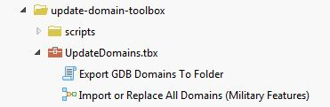
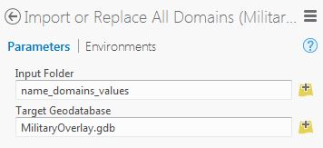

# military-features-data / data / mil2525d / utilities / military-features-utilities
==========================

## Purpose

* These utilities are used to create military feature classes, domains, and other feature and test data 
* Individual utilities and steps:
    * Update Military Features Domains - updates the geodatabase domains from source CSV(.csv) files
    * Create Military Features Geodatabase Template - creates a new geodatabase from source CSV(.csv) files
    * Add Military Feature Fields - adds the fields specified in a given schema to a given feature class.  The field specifications for the specified schema are defined in a CSV(.csv) file.

## Sections

* [Requirements](#requirements)
* [Instructions](#instructions)

## Requirements

* ArcGIS Professional 1.0+ (Toolbox requires ArcGIS Pro to open/use)

## Instructions

### Create Military Features Geodatabase Template

#### Overview

The utility creates a new File Geodatabase (GDB) in a specified folder, replacing any existing geodatabase of the same name in that folder.  The version of the newly created geodatabase can also be specified.

The structure of the geodatabase is determined by the contents of the CSV files found in a  folder selected at run-time.  The most recent version of these CSV files can be found [here](https://github.com/Esri/joint-military-symbology-xml/tree/master/samples/military_feature_schemas).

A Versions table is added to the newly created geodatabase.  The contents of that Versions table is based on the Versions.csv file found in the input folder, [here for example](https://github.com/Esri/joint-military-symbology-xml/tree/master/samples/military_feature_schemas/Versions.csv).  The "Version" information for `automated_creation_date` and `last_modification_date` are populated with the current date when the tool is run.

Each feature class created in the geodatabase is populated with the field specifications found in the corresponding field schema CSV files, also found [here](https://github.com/Esri/joint-military-symbology-xml/tree/master/samples/military_feature_schemas).

#### Steps

* Obtain the latest set of Military Features source data and utilities
	* Clone/download this repository to your local machine.
* Obtain the latest set of `military_feature_schemas` source CSV files
	* Clone/download the [Joint Military Symbology XML (JMSML) repository](https://github.com/Esri/joint-military-symbology-xml).
* Run ArcGIS Pro
* Navigate to the local location of the [template-gdb-toolbox GeoProcessing Toolbox](./template-gdb-toolbox).
* Run the *Create Military Features Geodatasbase Template* tool, found in the `GeodatabaseTemplate` toolbox.
	* For the `Schemas Folder` parameter, specify a folder containing the aforementioned schema CSV files.  These are normally found in your local JMSML samples folder, the clone you made of [this](https://github.com/Esri/joint-military-symbology-xml/tree/master/samples/military_feature_schemas).
	* For the `Folder` parameter, specify a destination folder for the newly created file geodatabase.  The name used to create the geodatabase, together with its entire dataset structure, is specified in the `Schemas.csv` file found in the schemas folder.  Any existing geodatabase in the output folder, with the same name, will be overwritten.
	* For the `Version` parameter, select from the list of possible geodatabase versions.  The current version of ArcGIS Pro is the default.
	* IMPORTANT: The *Create File Geodatabase* operation requires an exclusive schema lock on the geodatabase - therefore:
        * You should **not** have this geodatabase open elsewhere (for example, added to the current map), since you will be replacing it in that case, while performing this operation.
        * You must have full editing privileges (Update, Delete, etc.) to the folder and geodatabase you are creating/replacing in that folder.
    * When the tool runs successfully, open the geodatabase in design mode and verify that the expected feature dataset and feature classes have been created and that the feature classes have the fields expected.
    * Compare what is created with an en existing military features file [geodatabase](https://github.com/Esri/military-features-data/tree/master/data/mil2525d/core_data/gdbs).

### Add Military Feature Fields

#### Overview

The utility reads the field specifications stored in a CSV file (identified by schema name) and adds those fields to the specified feature class.  Note, the specified feature class must be empty before this tool is run.

The details for the fields to be added to the target feature class are derived from data exported from JMSML and stored in CSV files from [this](https://github.com/Esri/joint-military-symbology-xml/tree/master/samples/military_feature_schemas) folder.

The *Create Military Features Geodatabase Template* tool executes the *Add Military Feature Fields* tool in its operation.  The *Add Military Feature Fields* tool has been provided separately so a user can add the same set of fields to an already existing geodatabase (file or SDE) feature class.

**Again, use of this tool is optional.  Running the *Create Military Features Geodatabase Template* tool, described above, runs this tool behind the scenes to create a complete military features geodatabase.  Only use the *Add Military Feature Fields* tool separately when you want to add military feature fields to an existing empty feature class.**

#### Steps

* Obtain the latest set of Military Features source data and utilities
	* Clone/download this repository to your local machine.
* Obtain the latest set of `military_feature_schemas` source CSV files
	* Clone/download the [Joint Military Symbology XML (JMSML) repository](https://github.com/Esri/joint-military-symbology-xml).
* Run ArcGIS Pro
* Navigate to the local location of the [template-gdb-toolbox GeoProcessing Toolbox](./template-gdb-toolbox).
* Run the *Add Military Feature Fields* tool, found in the `GeodatabaseTemplate` toolbox.
	* For the `Schemas Folder` parameter, specify a folder containing the aforementioned schema CSV files.  These are normally found in your local JMSML samples folder, the clone you made of [this](https://github.com/Esri/joint-military-symbology-xml/tree/master/samples/military_feature_schemas).
	* For the `Feature Class` parameter, specify an existing feature class in a geodatabase of your choice, a feature class without military feature fields in it.
	* For the `Schema` parameter, specify one of the names of a JMSML schema.  The name of a given schema corresponds with the name of a `Fields_*.csv` file found in the Schemas folder and the name of the corresponding feature class created in a military features file geodatabase (see *Create Military Features Geodatabase Template* above).
	* IMPORTANT: The *Add Field* operation requires an exclusive schema lock on the feature class - therefore:
        * You should **not** have this feature class open elsewhere (for example, added to the current map) while performing this operation.
        * You must have full editing privileges (Update, Delete, etc.) to the geodatabase and feature class you are modifying with this operation.
    * When the tool runs successfully, examine the specified feature class in design mode and verify that the expected fields have been created.
    * Compare what is created with an en existing military features file [geodatabase](https://github.com/Esri/military-features-data/tree/master/data/mil2525d/core_data/gdbs).

### Update Military Features Domains

#### Overview

This utility updates the Geodatabase(GDB) domains of the [Military Features template database](../../core_data/gdbs) with the latest source data/values obtained from the [Joint Military Symbology](https://github.com/Esri/joint-military-symbology-xml) repository. This utility should be run periodically as the Joint Military Symbology repository is refined, improved, and updated.

The source data for this utility is a set of CSV files created in the Joint Military Symbology [`name_domains_values folder`](https://github.com/Esri/joint-military-symbology-xml/tree/master/samples/name_domains_values). The domain name is obtained from the CSV file name (with the "Coded_Domain" part removed) and the domain codes and description are obtained from the file contents.

A Geoprocessing (GP) Tool is then run on the source data to add or replace the GDB domains using the source data.

As a final (optional) validation step, once the domain data is imported into the GDB, the domains are then exported and compared to the original source data.

#### Steps

Importing the domain data:

* Obtain the latest set of Military Features source data and utilities
    * Clone/download this repository to your local machine.
* Obtain the latest set of `name_domains_values` source CSV files
    * Clone/download the  [Joint Military Symbology](https://github.com/Esri/joint-military-symbology-xml) repository.
    * You may also just download the files from the [`name_domains_values folder`](https://github.com/Esri/joint-military-symbology-xml/tree/master/samples/name_domains_values) in this repository
    * Note: although there are addition sample CSV files in this folder (ex. `*_Sample.csv`), the tools ignore these files using a file filter
* Run ArcGIS Pro
* Navigate to the local location of the  [update-domain-toolbox GeoProcessing Toolbox](./update-domain-toolbox)
    * The toolbox should look similar to this

* Run the *Import or Replace All Domains (Military Features)* GP Tool
    * As the `Input Folder` select the `joint-military-symbology-xml/tree/master/samples/name_domains_values` folder
    * As the `Target Geodatabase` select the desired Military Features template geodatabase (usually the one [obtained from here](../../core_data/gdbs)) 
        * IMPORTANT: The *Table To Domain* operation requires an exclusive schema lock on the geodatabase - therefore:
        * You should **not** have this geodatabase open elsewhere (for example, added to the current map) while performing this operation.
        * You must have full editing privileges (Update, Delete, etc.) to any feature class using this domain (mainly an issue if using SDE)
    * The GP Tool parameters will look similar to the following

* When the tool runs successfully, open the geodatabase in design mode and verify that the domains have been updated with the new source data

Verifying the domain data updates (*Recommended/Optional*):

* After running the *Importing the domain data* steps above
* Run ArcGIS Pro
* Navigate to the local location of the  [update-domain-toolbox GeoProcessing Toolbox](./update-domain-toolbox)
* Run the *Export GDB Domains to Folder* GP Tool
    * As the `Input Workspace` select the Military Features template geodatabase updated while performing the *Importing the domain data* steps above
    * As the `Output Folder` select an empty folder
    * This tool will export all Geodatabase domains to this folder

* When the tool runs successfully, open the `Output Folder` and verify that the folder contains one CSV file for each domain stored in the `Input Workspace`
* Using a Diff Utility (such as [WinMerge](http://winmerge.org/)) compare the folder of exported domains to the folder containing the original/source set of `name_domains_values` source CSV files to verify that the exported CSVs match the inported CSVs
    * Note: a Diff Utility may notice some slight differences, for example
        * Domains included in the Geodatabase that are not included in the source data
        * Leading zeroes in the source data imports that are not reflected in the export, for example
 
 
