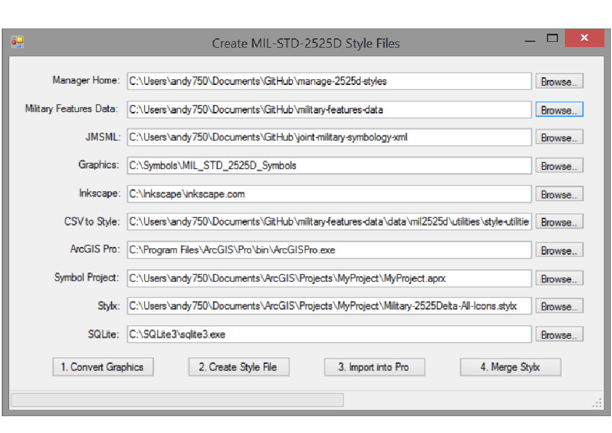

# manage-2525d-styles
Style files are the standalone files that ArcGIS uses to store reusable symbology and drawing information.  Style files store this information independently of the geographic features to be drawn, so a common set of symbol, label placement, drawing rule, color definition, and other bits of cartographic rendering information can be consistently applied to multiple datasets, quickly and easily.

Style files with the .style extension are used in ArcGIS Desktop (ArcMap/ArcCatalog/ArcGlobe) and are in fact Microsoft Access databases.  In ArcGIS Runtime these style files have a .dat extension and are SQLite databases.  ArcGIS Pro uses the same SQLite database format but uses a .stylx filename extension instead.

The application in this repository is designed to automate the use of data provided by the [Joint Military Symbology XML (JMSML)](https://github.com/Esri/joint-military-symbology-xml) repository with the tools and techniques available and documented in the style file utility section of the [Military Features Data](https://github.com/Esri/military-features-data) repository.

The stylx file creation procedures outlined in the Military Features Data repository are lengthy, complicated, somewhat cumbersome, and could lead to user frustration and error, particularly if the need arises to perform those operations repeatedly.  

In the interest of streamlining and automating the process of going from raw MIL-STD-2525D JMSML data to finished ArcGIS Pro ready military symbology stylx files, we've built this repository to simplify the work required.

Strict dependence on the JMSML and Military Features Data repositories exist here, so if anything significant changes, in terms of the data, procedures, or execution requirements documented in those repositories, amendments to the contents of this repository may be required.

## Features

* Converts DISA's svg files (as managed by JMSML) to an equivalent set of EMF files, according to the procedures and using the tools documented [here](https://github.com/Esri/military-features-data/tree/master/data/mil2525d/utilities/style-utilities/image-conversion-utilities).

* Creates military symbology style files from the aforementioned EMF files and the CSV image name category tag information exported from JMSML, according to the procedures and using the tools documented [here](https://github.com/Esri/military-features-data/tree/master/data/mil2525d/utilities/style-utilities/image-conversion-utilities).

* Launches ArcGIS Pro, loading a specified project file, so the user can import one or more of the aforementioned style files, which converts their contents to stylx.

* Merges the all-icon stylx file, created in the aforementioned step, with the manually managed drawing-and-label-rule stylx file, according to the procedures and using the tools documented [here](https://github.com/Esri/military-features-data/tree/master/data/mil2525d/utilities/style-utilities/merge-stylx-utilities).

## Sections

* [Requirements](#requirements)
* [Instructions](#instructions)
* [Other Documentation](#documentation)
* [Resources](#resources)
* [Issues](#issues)
* [Contributing](#contributing)
* [Licensing](#licensing)

## Requirements

* A text editor of your choice for viewing and/or editing the configuration file (if desired).
* To build the .NET Solution source you will need:
    * Visual Studio 2012 or later.
* This application makes use of the tools in the following GitHub repositories (these repositories need to be downloaded or cloned to your computer and the requirements outlined [here](https://github.com/Esri/military-features-data/tree/master/data/mil2525d/utilities/style-utilities) also need to be met):
	* [joint-military-symbology-xml](https://github.com/Esri/joint-military-symbology-xml)
	* [military-features-data](https://github.com/Esri/military-features-data)
* Image file conversion requires a copy of Inkscape, installed to a location whose fully qualified path is devoid of spaces.  Install it from [here](https://inkscape.org/en/).
* Creating the style files requires a built version of the CSV-to-Style application source located [here](https://github.com/csmoore/csv2ArcGISStyle).  A fully built deployment of this can also be found [here](https://github.com/Esri/military-features-data/blob/master/data/mil2525d/utilities/style-utilities/style-file-utilities/csv2ArcGISStyleDeployment.zip).
* Creating the stylx files requires a copy of ArcGIS Pro 1.1 or greater.
* Merging stylx files together requires a command line version of SQLite3.  A version of this can be downloaded from [here](http://www.sqlite.org/).

## Instructions

### General Help
[New to Github? Get started here.](http://htmlpreview.github.com/?https://github.com/Esri/esri.github.com/blob/master/help/esri-getting-to-know-github.html)

### Getting Started with the solution
* Open and build the Visual Studio Solution at manage-military-styles.sln
* Run the solution to see a form appear, which you can use to execute the aforementioned features.
* The config.xml file in the solution's executable folder will be used to initialize the paths to all of the above required data and tools.  Specifically, when this application is run and the form first appears, enter or browse to the following locations (default locations from the config file will initialize the appropriate text boxes):

	* **Manager Home** - The location of this local solution (a folder).
	* **Military Features Data** - The location of your local military-features-data repository (a folder).
	* **JMSML** - The location of your local joint-military-symbology-xml repository (a folder).
	* **Graphics** - The location, devoid of spaces, of the folder on your machine where graphics will be copied and converted (a folder).
	* **Inkscape** - The path, devoid of spaces, where your copy of Inkscape.com is installed (a file).
	* **CSV to Style** - The location of your local copy of the CSV to Style generation application (a folder).
	* **ArcGIS Pro** - The path to your installed instance of the ArcGIS Pro executable (a file).
	* **Symbol Project** - The path to the ArcGIS Pro project (aprx) file you wish to open, when launching ArcGIS Pro.
	* **Stylx** - The path to the stylx file you created when you used ArcGIS Pro to import the style file for all icons/symbols (a file).
	* **SQLite** - The path to your installed instance of SQLite (a file).

General execution of the various steps of the stylx generation process is from left to right, on the main form, with each preceding step required to complete successfully before moving on to the next step.

**1. Convert Graphics** - This automagically follows the procedures outlined [here](https://github.com/Esri/military-features-data/tree/master/data/mil2525d/utilities/style-utilities/image-conversion-utilities), first copying to your specified location all of the current JMSML SVG files, and then using Inkscape to convert those files to EMF.  When completed, Notepad is used to open up a log of the conversion process, so you can confirm its success.

**2. Create Style Files** - This automagically follows the procedures outlined [here](https://github.com/Esri/military-features-data/tree/master/data/mil2525d/utilities/style-utilities/style-file-utilities), to modify a copy of the image name category tag CSV files in the JMSML samples folder.  It then repeatedly runs the standalone CSV-to-Style creation process, that uses the contents of the CSVs and the associated EMFs created in the previous step to build new ArcGIS Desktop (ArcMap) style files.  When completed, Notepad is used to open up a log of the creation process, so you can confirm its success.

**3. Import into Pro** - This quite simply starts up your instance of ArcGIS Pro, with the project file you specified.  Once ArcGIS Pro has started, you will need to use the desktop tools to import the **Military 2525Delta All.style** file into your project, which will convert it to an ArcGIS Pro stylx file.

**4. Merge Stylx** - This automagically follows the procedures outlined [here](https://github.com/Esri/military-features-data/tree/master/data/mil2525d/utilities/style-utilities/merge-stylx-utilities) to modify a copy of the military features data SQLite script file, and then it uses that to merge the stylx file created in step three above (which contains points only) with the line, areas, and label information contained in the manually managed file [here](https://github.com/Esri/military-features-data/blob/master/data/mil2525d/core_data/stylxfiles/mil2525d-lines-areas-labels-base-template.stylx).  When completed, Notepad is used to open up a log of the merge process, so you can confirm its success.

**Final Results** - When all four steps are successfully completed, you should find several finished style and one new stylx file in the StyleOutputData folder of this repository.

## Documentation

- To learn more about the Joint Military Symbology XML GitHub repository, go [here](https://github.com/Esri/joint-military-symbology-xml).
- To learn more about the Military Features Data GitHub repository, go [here](https://github.com/Esri/military-features-data).

## Resources

* Learn more about Esri's [ArcGIS for Defense maps and apps](http://resources.arcgis.com/en/communities/defense-and-intelligence/).

## Issues

Find a bug or want to request a new feature?  Please let us know by submitting an issue.

## Contributing

Esri welcomes contributions from anyone and everyone. Please see our [guidelines for contributing](https://github.com/esri/contributing).

## Licensing

Copyright 2015 Esri

Licensed under the Apache License, Version 2.0 (the "License");
you may not use this file except in compliance with the License.
You may obtain a copy of the License at

   http://www.apache.org/licenses/LICENSE-2.0

Unless required by applicable law or agreed to in writing, software
distributed under the License is distributed on an "AS IS" BASIS,
WITHOUT WARRANTIES OR CONDITIONS OF ANY KIND, either express or implied.
See the License for the specific language governing permissions and
limitations under the License.

A copy of the license is available in the repository's
[license.txt](license.txt) file.

