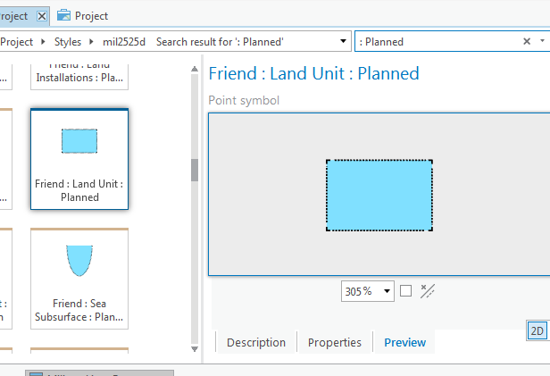

# military-features-data / data / mil2525d / utilities / style-utilities / svg-dash-workaround

## Purpose

* This utility replaces dash patterns in a set of Scalable Vector Graphics (.svg) files
* It is a WORKAROUND to an issue encountered where the dash patterns of the SVG frames are not apparent or visible at smaller scales
    * This issue is most apparent when the symbols are viewed as symbols on a map where there size is 128 points or less
    * Without this workaround, the dashed symbol frames will appear this way when run through the complete conversion process

## Instructions 

* Using a text editor, edit the [stroke-dash-array-workaround.bat](./stroke-dash-array-workaround.bat) batch file in this folder
    * IMPORTANT: Modify the .bat command file to match your local paths
    * Open and edit the .bat file, find the "IMPORTANT/TODO" section at the top, and edit the line/path:
        * `SET svg_source_folder=C:\{TODO_EDIT_PATH_TO_SVGs}`
        * Set `C:\{TODO_EDIT_PATH_TO_SVGs}` to the fully qualified path of the joint-military-symbology-xml SVG Files
        * Ex: `C:\Github\joint-military-symbology-xml\svg\MIL_STD_2525D_Symbols`
* Run the stroke-dash-array-workaround.bat file
    * Double click on the file 
    * -or- open a command prompt 
        * `cd {local-path-to*}` 
        * `stroke-dash-array-workaround.bat`
    * Check the output for errors
* Check the SVG source folder that the workaround has been applied
    * Open a command prompt
    * `cd {local-path-to*}\joint-military-symbology-xml\svg\MIL_STD_2525D_Symbols\Frames`
    * `findstr /s /c:"stroke-dasharray" *.svg > stroke-dash-array-check.txt`
    * Open the resulting file `stroke-dash-array-check.txt` in a text editor and verify that *most* of the `stroke-dasharray` values show `stroke-dasharray="75,45"`
        * If you would like to see the values replaced, see the [replacement script](./PowerShellReplaceMultiple.ps1)

`*` Note: Replace `{local-path-to}` with the fully qualified path, ex: `C:\Github\....`