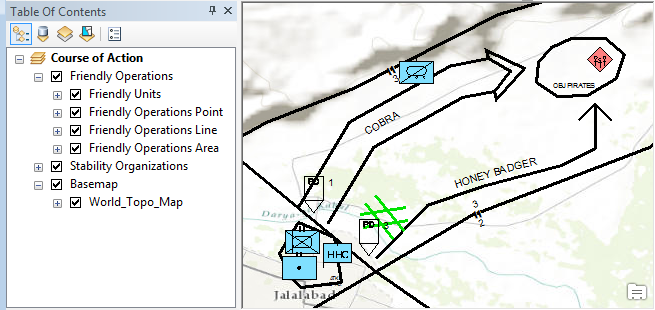

# military-features

Military Features is a set of data for use in ArcGIS 10 Desktop and Engine. This data is used to create features for planning, operations and intelligence domains based on military symbology specifications such as MIL-STD-2525.

## Features

* This is the source data for the ArcGIS for Defense [Military Features solution](http://solutions.arcgis.com/defense/help/military-features/).
* Military Features was implemented using out-of-box symbology capabilities available at ArcGIS 10.
* It includes a datamodel for drawing and labeling symbols using the ArcGIS Cartographic Renderer and Maplex Labeling Engine 
* Allows the desktop user to create command and control (C2) operational features based on military symbology specifications MIL-STD-2525C in ArcGIS Desktop.
* Provides project/layer packages that include the database schema and sample data for military features.
* Primarily for scenarios where authors can pre-author their symbols using ArcGIS Desktop.

## Requirements

* ArcGIS Desktop or Engine 10.3.1+ 

## Using

* For more information see the [Military Features solution](http://solutions.arcgis.com/defense/help/military-features/).

Includes:

* [Layer packages](./mil2525c/lpks) defining layers and data for drawing and labeling symbols
* A [geodatabase](./mil2525c/geodatabase) with a stand-alone datamodel for drawing and labeling symbols

