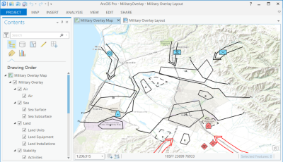

# military-overlay

Military Overlay is a solution for creating and sharing military overlays. It is primarily a datamodel for creating, drawing, and sharing Military Symbols. This datamodel is used by the Dictionary Renderer included with ArcGIS Pro, Runtime, and Server to render Military Symbols.

## Features

* A solution using a complex attribute renderer (the Dictionary Renderer) included with ArcGIS Pro, Runtime, and Server
* A datamodel for drawing and labeling symbols using the Dictionary Renderer
* Data included with the [Military Overlay solution](http://solutions.arcgis.com/defense/help/military-overlay/)
* [Utilities for creating the Military Overlay datamodel and test data](./utils-source-and-test-data)
  
## Requirements

* ArcGIS Pro 1.4+ 
* ArcGIS Server 10.5+

## Using

* For more information see the [Military Overlay solution](http://solutions.arcgis.com/defense/help/military-overlay/).

Includes:

* Layer packages - defining layers and data for drawing and labeling symbols
* Geodatabases - geodatabases with datamodel for drawing and labeling symbols
* Schema information for each version of the standard
    * [mil2525d](./mil2525d)
    * [mil2525c](./mil2525c)
    * [mil2525b2](./mil2525b2)
* [Utilities for creating the Military Overlay datamodel and test data](./utils-source-and-test-data)
    
## Resources

* [Military Overlay solution](http://solutions.arcgis.com/defense/help/military-overlay/)
* [ArcGIS Pro Dictionary Renderer Help Page](https://pro.arcgis.com/en/pro-app/help/mapping/symbols-and-styles/dictionary-renderer.htm) 
